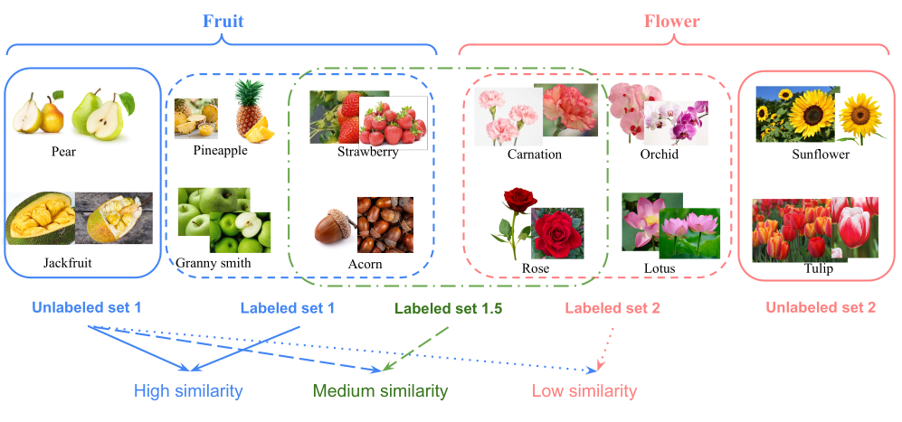

# NCDSimilarityBench

This repository contains a standalone implementation of our semantic similarity benchmark 
proposed in our TMLR paper 

> **Supervised Knowledge May Hurt Novel Class Discovery Performance**<br>
> Ziyun Li, Jona Otholt, Ben Dai, Di Hu, Christoph Meinel, Haojin Yang

Our main repository for the paper can be found [here](https://github.com/J-L-O/SK-Hurt-NCD).
The benchmark is based on the ImageNet dataset [1] and the Entity30 subpopulation shift task 
introduced in [2].
It consists of multiple labeled and unlabeled datasets with varying degrees of semantic 
similarity between them.

<div style="text-align: center;">
  
</div>

By combining different labeled and unlabeled datasets, we can create NCD tasks that, while 
sharing the number of labeled and unlabeled classes, differ in the semantic similarity 
between them.
This enables researchers to evaluate their methods under varying degrees of semantic
similarity.
This standalone package allows to easily use the benchmark for your own
experiments.
In addition, this package includes an extension of the benchmark to the GCD setting [3].

## Installation

To install the package, simply run

```bash
pip install git+https://github.com/J-L-O/NCDSimilarityBench.git
```

The package requires Python 3.7 or higher and depends on numpy and torchvision.

## References

[1] Deng, Jia, et al. "Imagenet: A large-scale hierarchical image database." 2009 IEEE conference on computer vision and pattern recognition. Ieee, 2009.

[2] Santurkar, Shibani, Dimitris Tsipras, and Aleksander Madry. "BREEDS: Benchmarks for Subpopulation Shift." International Conference on Learning Representations. 2021.

[3] Vaze, Sagar, et al. "Generalized category discovery." Proceedings of the IEEE/CVF Conference on Computer Vision and Pattern Recognition. 2022.
